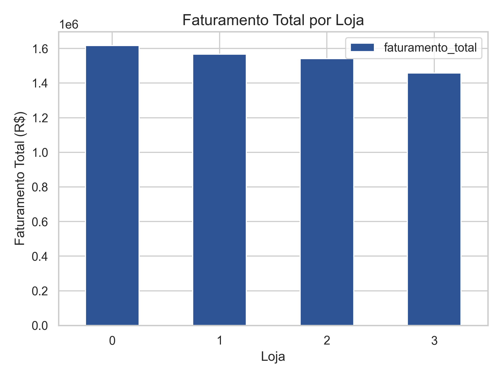
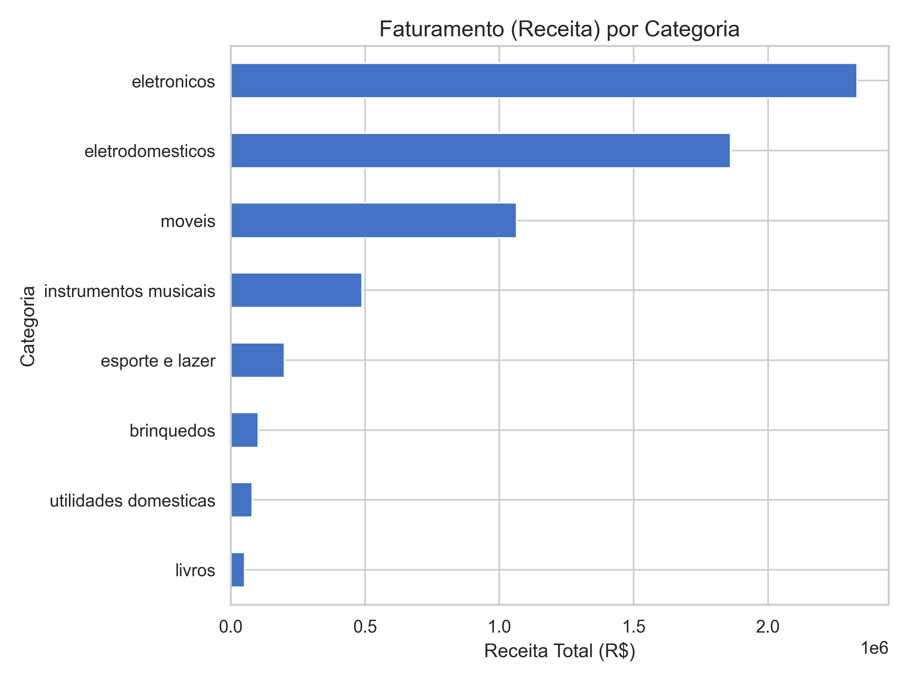
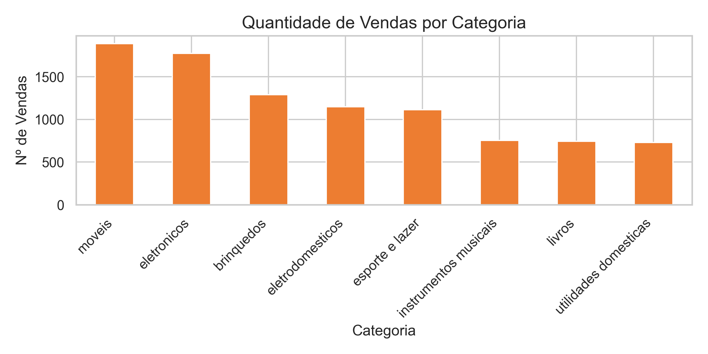
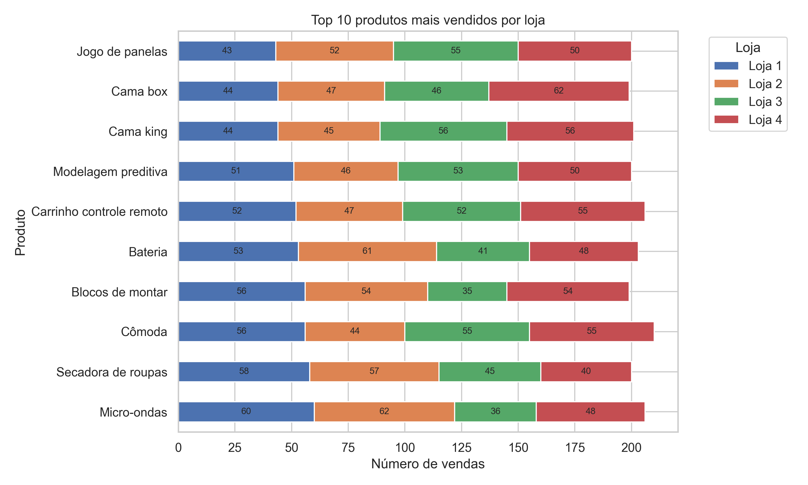
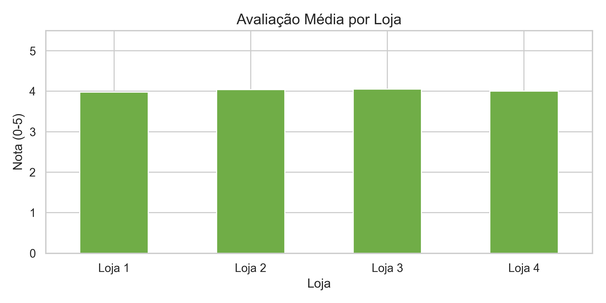

# 👑 Análise de Eficiência das Lojas – Rede Alura Store

Projeto de Ciência de Dados que responde à pergunta:

> **“Com base nos dados históricos de vendas, qual loja da rede Alura Store deve ser vendida?”**

Além de entregar a resposta do desafio, este projeto foi estruturado para demonstrar:

- organização de projeto de dados,
- definição e cálculo de KPIs de negócio,
- visualização e storytelling,
- e comunicação clara de recomendações.

---

## 🎯 Sumário Executivo

| Indicador              | Melhor Loja                 | Pior Loja                 | Observação                                                             |
| :--------------------- | :-------------------------- | :------------------------ | :--------------------------------------------------------------------- |
| **Faturamento Total**  | Loja 1 (≈ R$ 1,62M)         | **Loja 4** (≈ R$ 1,46M)   | Loja 4 gera menos receita para a rede                                  |
| **Ticket Médio**       | Loja 1 (≈ R$ 685,18)        | **Loja 4** (≈ R$ 618,43)  | Clientes da Loja 4 compram menos por pedido                           |
| **Avaliação Média**    | Loja 3 (≈ 4,05)             | Loja 1 (≈ 3,98)           | Loja 3 equilibra boa receita com a melhor experiência do cliente       |
| **Frete Médio**        | **Loja 4** (≈ R$ 31,28)     | Loja 1 (≈ R$ 34,69)       | Loja 4 é mais eficiente em frete, mas isso não compensa a baixa receita |

> ✅ **Recomendação final:**
> Vender a **Loja 4**, por ser a unidade com **menor eficiência em geração de receita** e **menor impacto financeiro** ao ser retirada da rede.

---

## 🧩 1. Contexto do Desafio

O Senhor João é dono da **rede Alura Store**, composta por 4 lojas.
Ele pretende vender **uma** delas para levantar capital e investir em um novo empreendimento.

**Pergunta central:**

> *“Qual das quatro lojas deve ser vendida, considerando faturamento, avaliação dos clientes, mix de vendas e frete?”*

A partir dos arquivos CSV de cada loja, este projeto:

- consolida os dados em uma base única,
- trata e padroniza as variáveis,
- constrói KPIs de negócio,
- analisa o desempenho de cada loja,
- e apresenta uma recomendação final baseada em dados.

---

## 🛰️ 2. Visão Geral do Projeto

### 2.1. Fluxo de trabalho

1. **Coleta & Consolidação**
   - Leitura dos 4 CSVs (`loja_1.csv`, …, `loja_4.csv`) usando `pandas`.
   - Criação da coluna `Loja` para identificar a origem de cada venda.
   - Empilhamento das tabelas em um único DataFrame `dados`.

2. **Tratamento dos Dados**
   - Padronização dos nomes das colunas em `snake_case`.
   - Conversão de `data_da_compra` para `datetime`.
   - Conversão de `preço` e `frete` para numérico.
   - Tratamento de valores nulos em campos financeiros.
   - Criação das colunas:
     - **`receita`** = `preço + frete`
     - **`ano_mes`** = período agregado (mês/ano) para análise temporal.

3. **Análise Exploratória & KPIs**
   - Faturamento total por loja e faturamento mensal.
   - Faturamento e volume de vendas por categoria.
   - Produtos mais vendidos e menos vendidos.
   - Avaliação média por loja.
   - Frete médio por loja.
   - Tabela-resumo consolidando os KPIs por loja, incluindo **ticket médio**.

4. **Storytelling & Recomendação**
   - Leitura cruzada dos indicadores.
   - Interpretação de trade-offs (faturamento × satisfação × frete).
   - Recomendação de qual loja deve ser vendida.

### 2.2. Boas práticas aplicadas

- Estrutura de notas / células em estilo de **projeto profissional**, com:
  - contexto → setup → tratamento → KPIs → comparativo → recomendação.
- Comentários explicando o **porquê de cada transformação** (não só o “como”).
- Separação clara entre:
  - dados brutos (`dados`),
  - resultados/agrupamentos (DataFrames agregados),
  - e visualizações.
- Cálculo de KPIs com `groupby`, `agg`, `value_counts` e colunas derivadas.
- Construção de gráficos em camadas (preparação → desenho → contexto/títulos).

---

## 📊 3. Resultados – Storytelling das Lojas

Em vez de olhar os gráficos de forma solta, o objetivo aqui é contar a história de cada loja a partir dos dados.

### 3.1. Quem realmente sustenta o faturamento?

Primeiro, foi calculado o **faturamento total** (receita) por loja.

> **Pergunta:** qual loja é mais importante para a receita da rede?

Gráfico de faturamento total por loja:

Do gráfico, vemos que:

- **Loja 1** é a campeã de faturamento, com mais de **R$ 1,6 milhão**.
- **Lojas 2 e 3** mantêm receitas muito próximas, formando um “meio de tabela” forte.
- **Loja 4** aparece sempre na lanterna, com cerca de **R$ 1,46 milhão**, sendo a menor fonte de receita da rede.

**Leitura de negócio:** se o João vender a Loja 4, ele abre mão da menor fatia do bolo de faturamento.

Também foi analisado o **faturamento mensal**, consolidando todas as lojas por `ano_mes`, para entender a evolução temporal da receita e possíveis sazonalidades.

---

### 3.2. Categorias e produtos: o que puxa as vendas?

Para entender *o que* está sendo vendido:

#### 🔹 Faturamento e volume por categoria

Dois gráficos principais:

- **Faturamento por categoria**
- **Quantidade de vendas por categoria**

A leitura combinada mostra que:

- As categorias Móveis e Eletrônicos concentram tanto **alto faturamento** quanto **alto volume**, sendo núcleo duro do negócio.
- Já a categoria Eletrodoméstico tem **pouco volume, mas alto faturamento**, indicando itens mais “premium”.

Isso ajuda a entender o posicionamento das lojas em termos de mix de produtos e categorias.

#### 🔹 Top 10 produtos mais vendidos por loja

Para não ficar só no nível de categoria, foi analisada a distribuição dos **10 produtos mais vendidos**, por loja.

Nesse gráfico:

- Cada barra horizontal é um produto do Top 10.
- Cada cor representa uma loja.
- Os números dentro das barras mostram **quantas unidades cada loja vendeu** daquele produto.

A partir dele, é possível ver que:

- Os produtos campeões de venda são bem distribuídos entre as **Lojas 1, 2 e 3**.
- A **Loja 4 participa**, mas raramente domina sozinha o volume de algum item estratégico.
- Não existe um “produto salvador” que torne a Loja 4 indispensável apenas pelo mix.

> **Conclusão parcial:** do ponto de vista de produtos e categorias, as lojas mais estratégicas continuam sendo as Lojas 1, 2 e 3.

---

### 3.3. Experiência do cliente: quem entrega mais valor percebido?

A percepção dos clientes foi analisada via **avaliação média da compra** por loja.

Os resultados indicam que:

- **Loja 3** é a **melhor avaliada**, com nota média em torno de 4.
- **Loja 2** também apresenta uma avaliação sólida, bem próxima da Loja 3.
- **Loja 1** tem a **pior avaliação média**, apesar de ser a líder em faturamento.
- **Loja 4** fica em um meio-termo: não é a pior, mas também não se destaca.

Isso cria um equilíbrio interessante:

- **Loja 1:** crítica em experiência, mas extremamente relevante em faturamento.
- **Loja 3:** ótima combinação de receita + satisfação.
- **Loja 4:** não é destaque em nenhuma dimensão.

---

### 3.4. Logística e frete: custa caro vender onde?

O último pilar analisado foi o **frete médio por loja**.

O gráfico mostra que:

- **Loja 4** possui o **frete médio mais barato** da rede.
- **Loja 1** tem o frete médio mais caro.
- Lojas 2 e 3 ficam em uma faixa intermediária.

À primeira vista, isso poderia ser um argumento a favor da Loja 4 (“frete mais barato é bom para o negócio”).
Porém, quando cruzamos frete com **faturamento** e **ticket médio**, o cenário muda:

> O frete mais barato da Loja 4 **não compensa** o fato de ela ser a loja que menos gera receita e valor por venda.

---

## 🧮 4. Comparativo Consolidado Entre Lojas

Para apoiar a decisão de forma objetiva, foi criada uma **tabela-resumo** com os principais KPIs por loja:

- Faturamento total
- Avaliação média
- Frete médio
- Número de vendas
- Ticket médio

| Loja   | Faturamento total | Avaliação média | Frete médio | Número de vendas | Ticket médio |
| ---    | ---               | ---             | ---         | ---              | ---          |
| Loja 1 | R$ 1.616.347,09   | 3,977           | R$ 34,69    | 2359             | R$ 685,18    |
| Loja 2 | R$ 1.567.773,22   | 4,037           | R$ 33,62    | 2359             | R$ 664,59    |
| Loja 3 | R$ 1.542.047,69   | 4,048           | R$ 33,07    | 2359             | R$ 653,69    |
| Loja 4 | R$ 1.458.253,46   | 3,996           | R$ 31,28    | 2358             | R$ 618,43    |

Traduzindo essa tabela em “personas”:

- **Loja 1** – *“Eu vendo muito e tenho o maior ticket médio, mas preciso melhorar a experiência do cliente e rever meu frete.”*
- **Loja 2** – *“Sou equilibrada: boa receita, boa avaliação, frete razoável.”*
- **Loja 3** – *“Sou a queridinha: boa receita e a melhor avaliação dos clientes.”*
- **Loja 4** – *“Sou a que menos vende, tenho o menor ticket médio. Meu frete é barato, mas não trago tanto retorno quanto as demais.”*

---

## 🧠 5. Recomendação Final

Considerando:

- **Menor faturamento total**,
- **Menor ticket médio**,
- Avaliação apenas mediana (sem destaque),
- Frete mais barato, mas insuficiente para compensar o desempenho fraco,

> ✅ A **Loja 4** é a **candidata mais adequada para ser vendida**.

Ela é a unidade que:

- **menos contribui para o faturamento total**,
- entrega **menos valor por venda** (ticket médio),
- e não apresenta vantagem clara em satisfação de clientes.

Ao vender a Loja 4, o Senhor João:

- preserva as lojas que são mais fortes em:
  - **receita** (Loja 1),
  - **equilíbrio entre receita e satisfação** (Lojas 2 e 3);
- reduz o impacto financeiro negativo da venda;
- abre espaço para investir em melhorias nas lojas estratégicas (por exemplo, experiência do cliente na Loja 1).

---

## 🚀 6. Próximos Passos Possíveis

Algumas extensões naturais deste projeto:

- **Simulações de cenários**
  - Impacto da venda da Loja 4 na receita total da rede.
  - Redistribuição da demanda da Loja 4 entre as demais lojas.

- **Análises adicionais de rentabilidade**
  - Considerar margem por produto/categoria (não apenas faturamento bruto).

- **Dashboard interativo**
  - Migrar as principais métricas para um dashboard em `Streamlit` ou Power BI.

- **Segmentação de clientes**
  - Se houver dados adicionais, explorar perfis de clientes e comportamento de compra.

---

## 🧪 Como Reproduzir este Projeto

1. **Clone o repositório.**
2. **Instale as dependências** com o ambiente virtual ativado:
   `pip install -r requirements.txt`
3. **Execute o notebook** `notebooks/AluraStoreBrasil.ipynb` em sequência para reproduzir as análises e gráficos.

---

## 👤 Autor

Projeto desenvolvido por **Wilson Maciel**

- LinkedIn: <https://www.linkedin.com/in/wilsonmaciel/>
- GitHub: <https://github.com/Wilson-Maciel>
